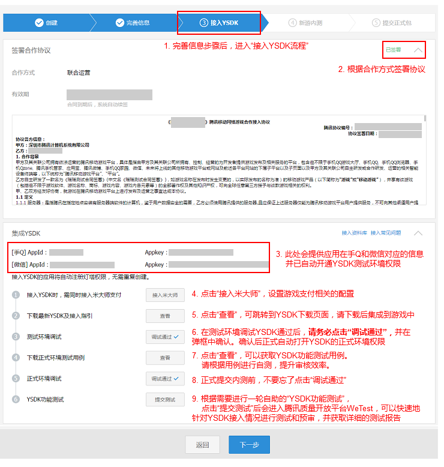

## YSDK介绍

### 1. YSDK简介
YSDK是腾讯应用宝开发团队为移动游戏开发者提供的公共组件和服务库，旨在帮助开发者快速接入腾讯平台，提升游戏接入和上线效率。

### 2. 模块介绍

| 模块名称 | 模块功能 | 接入条件 | 
|:-------------:|:-------------:|:-------------:| 
| 数据分析模块 | 提供数据上报, 异常上报的能力 | 需要手Q appId |
| 手Q | 提供手Q登录，拉取个人信息的能力 | 需要手Q appId和appKey|
| 微信 | 提供微信登录，拉取个人信息的能力 | 需要微信 appId和appKey|
| 支付 | 提供米大师（midas）相关的支付能力 | 需要midas的offerid|

**备注：所有appid怎么申请，在SDK接入中的“Appid及权限申请”有具体说明。** 

### 3. 名词解释

| 名称 | 名词概述 |
|:-------------:|-------------|
| 平台| 微信，手Q统称平台|
|openId|用户授权后平台返回的唯一标识|
|accessToken|用户授权票据, 获取此票据以后可以认为用户已经授权, 分享/支付等功能需要此票据. 手Q的accessToken有效时间为90天. 微信的accessToken有效时间为2小时.|
|payToken|支付票据, 此票据用于手Q支付, 手Q授权会返回此票据。微信授权不会返回此票据. 有效时间为6天。|
|offerId|支付时使用，安卓的offerid为手Qappid|
|refreshToken|微信平台特有票据, 有效期为30天, 用于微信accessToken过期之后刷新accessToken.|
|异帐号|游戏中授权的账号和手Q/微信中授权的账号不相同, 此种场景称之为异账号.|
|游戏中心|手Q客户端或微信客户端中的游戏中心统称游戏中心。|
|安装渠道|游戏上线前打包会根据不同渠道(例如应用宝,豌豆荚,91等)生成不同渠道号的apk包, 在安装包中的渠道号称之为安装渠道.|
|注册渠道|用户首次登陆时, 游戏的安装渠道, 会在MSDK后台记录, 算作用户注册渠道.|
|Pf|支付需要使用到的字段, 用于数据分析使用, pf的组成为: 唤起平台_账号体系-注册渠道-操作系统-安装渠道-账号体系-appid-openid.例如：desktop_m_qq-73213123-android-73213123-qq-100703379-A65A1614A2F930A0CD4C2FB2C4C5DBE1|
|pfKey| 支付使用|
|协作者账号|游戏在正式上线前，手Q只能使用协作者账号登陆，否则会在登陆时，在手Q的界面报110406或者110404错误，[点击查看如何添加协作者账号]()。|

### 4. YSDK环境权限

应用的appid和权限申请主要分为两部分，手Q和微信的appid以及midas对应的offerid，这里只介绍手Q和微信的appid，midas的offerid在支付接入中有具体说明。

#### 4.1 手Q、微信 Appid及测试环境权限

在http://open.qq.com 完成基本资料审核后，**流程到达“接入YSDK”，签署合作接入协议以后就会提供手Q和微信的appid和appkey，此时会同步开启测试环境权限**，参照下图：

	
至此，应用所有的测试环境权限都已经OK，可以开始SDK的接入了。

#### 4.2 正式环境权限

当应用在YSDK相关的测试环境调试成功以后，就可以自助开通正式环境的权限。具体流程如下：在http://open.qq.com 完成接入YSDK后，**在流程“接入YSDK”中，合作协议的下方有应用的appid以及接入SDK的指引流程**，点击流程第三步测试环境调试后方的调试通过按钮，并在弹框中选择确认以后，即可开通YSDK正式环境权限（参照上图）。

- 注意事项：

1. 建议在测试环境调通所有功能以后再切换到正式环境调试。
