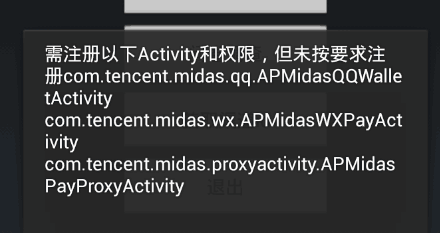
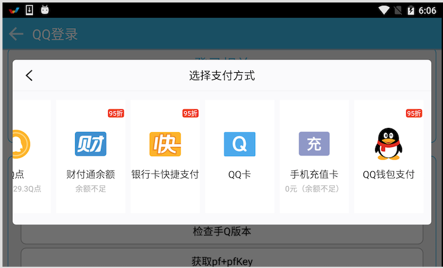
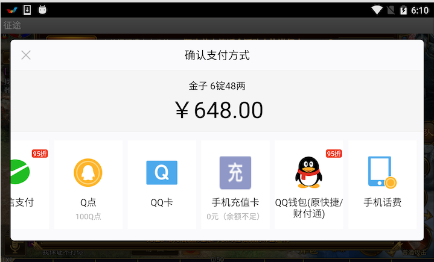

# 5. 支付（Midas）接入

## 5.1 模块介绍

1. YSDK 从 1.1.0 版本开始支持midas接入。通过该功能，应用开发者可以接入腾讯相关的支付渠道。**从1.2.2版本开始充值不再需要依赖腾讯充值的app（建议游戏尽快更新到1.2.2及以上版本），从1.2.3版本开始加入道具直购（目前仅提供给单机游戏使用）。**。
- 该模块在接入时需修改应用assers目录下ysdkconf.ini文件中的offerid(修改方法参考SDK接入中的介绍)。该模块无需额外的初始化工作，所有工作，在初始化YSDK时已经由SDK完成。
- 游戏使用的YSDK支付模块的环境与YSDK环境一致，例如当游戏使用ysdktest.qq.com的域名是，同时对应支付模块的沙箱环境。当域名使用ysdk.qq.com时，对应支付模块的正式环境。

## 5.2 配置修改

### 5.2.1 Midas接入AndroidMainfest修改

- 游戏按照下面的事例填写配置信息。

		 <!-- TODO GAME SDK Midas接入配置 设置屏幕兼容声明 START -->
	    <uses-permission android:name="android.permission.INTERNET" />
	    <uses-permission android:name="android.permission.ACCESS_NETWORK_STATE" />
	    <uses-permission android:name="android.permission.WRITE_EXTERNAL_STORAGE" />
	    <uses-permission android:name="android.permission.READ_PHONE_STATE" />
	    <uses-permission android:name="android.permission.ACCESS_WIFI_STATE" />
	    <uses-permission android:name="android.permission.CHANGE_WIFI_STATE" />
	    <uses-permission android:name="android.permission.RESTART_PACKAGES" />
	    <uses-permission android:name="android.permission.GET_TASKS" />
	    <uses-permission android:name="android.permission.READ_SMS" />
	    <uses-permission android:name="android.permission.SEND_SMS"/>
	    <uses-permission android:name="android.permission.WRITE_SETTINGS"/>
	    <uses-permission android:name="android.permission.MOUNT_UNMOUNT_FILESYSTEMS" />
	    <supports-screens
	        android:anyDensity="true"
	        android:largeScreens="true"
	        android:normalScreens="true" />
	    <!-- TODO GAME SDK Midas接入配置 设置屏幕兼容声明 END -->
	    
 		<!-- TODO GAME SDK Midas接入配置 START -->
        <activity
            android:name="com.tencent.midas.proxyactivity.APMidasPayProxyActivity"
            android:theme="@android:style/Theme.Translucent.NoTitleBar"
            android:screenOrientation="portrait"
            android:configChanges="orientation|keyboardHidden|screenSize" />
        <activity
            android:name="com.tencent.midas.wx.APMidasWXPayActivity"
            android:theme="@android:style/Theme.Translucent.NoTitleBar"
            android:exported="true" />

        <activity
            android:name="com.tencent.midas.qq.APMidasQQWalletActivity"
            android:launchMode="singleTop"
            android:theme="@android:style/Theme.Translucent.NoTitleBar"
            android:configChanges="orientation|keyboardHidden"
            android:exported="true" >
            <intent-filter>
                <action android:name="android.intent.action.VIEW" />
                <category android:name="android.intent.category.BROWSABLE"/>
                <category android:name="android.intent.category.DEFAULT"/>
                <data android:scheme="qwallet100703379"/>
                 <!-- TODO GAME 这里为米大师的默认配置，游戏不要修改 -->
            </intent-filter>
        </activity>
        <activity android:name="com.tencent.midas.jsbridge.APWebJSBridgeActivity"
            android:theme="@android:style/Theme.Translucent.NoTitleBar"
            android:windowSoftInputMode="stateAlwaysHidden"/>
        <!-- TODO GAME SDK Midas接入配置 END -->
        
### 5.2.2 Midas插件添加		

将YSDKRes的assets中的MidasPay.zip完整拷贝到游戏apk的assets中，**如果使用过老版本YSDK，集成过TencentPay.apk的，请删除;否则会导致拉起支付时报如下错误：**。

### 5.2.3 Midas支付渠道修改		

目前米大师开始逐步用QQ钱包替代财付通和银行卡快捷支付两个充值渠道，为了尽可能小的减小渠道切换对用户体验的影响，米大师提供了在QQ钱包后增加原快捷财付通字样的提示。这部分内容目前需要独立配置，游戏在接入中如果发现自己QQ钱包渠道后没有提示信息，可以直接联系企业QQ：800013811增加。下图为修改前后的事例：

- 修改前：

- 修改后：

## 5.3 游戏支付异常检查步骤

#### 第一步：确认是否能够成功拉起支付界面

如果可以，请直接到下一步，如果不可以，请检查是否是因为以下原因引起的？

1. 如果游戏使用的SDK的版本为YSDK 1.2.2以下版本，请更新到1.2.2及以上版本，**同时确认已经删除了apk的assets中的TencentPay.apk**。
2. 如果未能拉起支付，但是界面有弹框报错，请直接到第四步，查看对应的错误码。
3. 如果没有任何反应，或者发生crash，检查Logcat日志，一般logcat日志中都会有具体说明。

#### 第二步：检查游戏支付相关配置是否正确

游戏支付相关的配置包括：offerid、调用YSDK的recharge接口的zoneid、游戏对应支付环境的权限等参数是否正确，具体参数检查可以参考下面的链接：

- offerid：[http://wiki.open.qq.com/wiki/%E7%B1%B3%E5%A4%A7%E5%B8%88%E7%AE%80%E4%BB%8B#2.1_offerid.E5.92.8Cappkey](http://wiki.open.qq.com/wiki/%E7%B1%B3%E5%A4%A7%E5%B8%88%E7%AE%80%E4%BB%8B#2.1_offerid.E5.92.8Cappkey)
- zoneid：[http://wiki.open.qq.com/wiki/%E7%B1%B3%E5%A4%A7%E5%B8%88%E7%AE%80%E4%BB%8B#2.4_.E5.A4.A7.E5.8C.BAID.EF.BC.88zoneid.EF.BC.89](http://wiki.open.qq.com/wiki/%E7%B1%B3%E5%A4%A7%E5%B8%88%E7%AE%80%E4%BB%8B#2.4_.E5.A4.A7.E5.8C.BAID.EF.BC.88zoneid.EF.BC.89)
- 支付环境权限：[http://wiki.open.qq.com/wiki/%E7%B1%B3%E5%A4%A7%E5%B8%88%E7%AE%80%E4%BB%8B#2.2_Midas.E7.8E.AF.E5.A2.83.E5.8F.8A.E6.9D.83.E9.99.90](http://wiki.open.qq.com/wiki/%E7%B1%B3%E5%A4%A7%E5%B8%88%E7%AE%80%E4%BB%8B#2.2_Midas.E7.8E.AF.E5.A2.83.E5.8F.8A.E6.9D.83.E9.99.90)

#### 第三步：检查米大师初始化相关配置是否正确

目前YSDK已经彻底封装了Midas，游戏可以直接使用YSDK提供的充值接口充值，无须再单独初始化米大师，如果重复初始化有可能会引起支付异常的问题，游戏要删除相关代码。

#### 第四步：在支付界面选择商品以后支付报错

在YSDK wiki上有关于米大师客户端支付报错的详细说明，游戏可以点击查看原因及解决方案：

[http://wiki.open.qq.com/wiki/Android%E5%B8%B8%E8%A7%81%E9%94%99%E8%AF%AF%E7%A0%81%E6%9F%A5%E8%AF%A2](http://wiki.open.qq.com/wiki/Android%E5%B8%B8%E8%A7%81%E9%94%99%E8%AF%AF%E7%A0%81%E6%9F%A5%E8%AF%A2)

