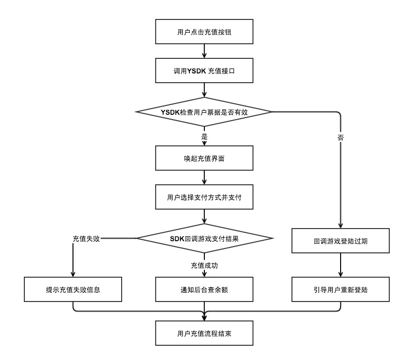
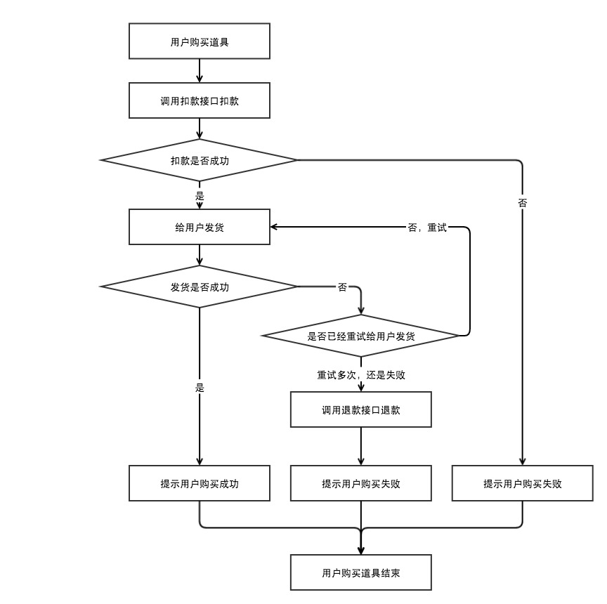
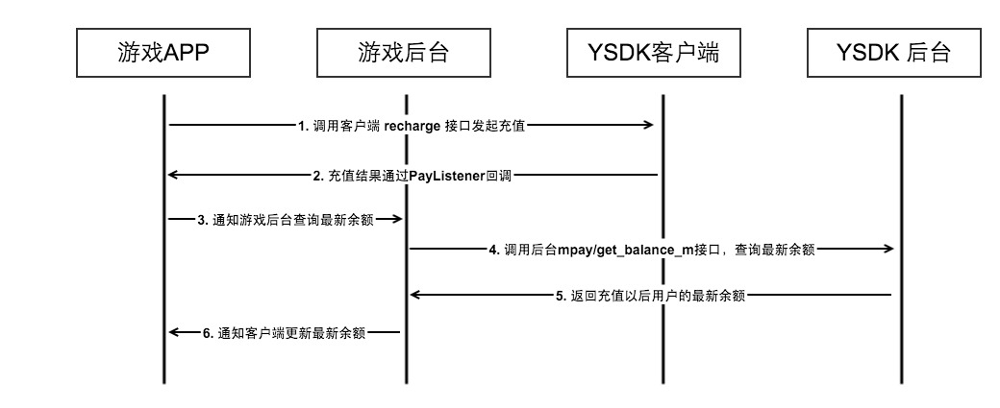
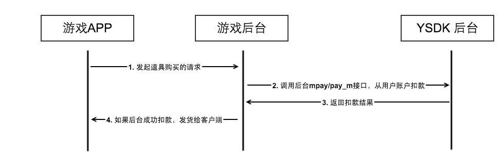
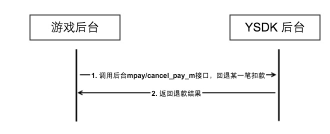

# 米大师介绍

## 4. 游戏币托管模式介绍

### 4.1 托管模式概述

这部分内容主要介绍游戏币托管模式的业务流程，具体包括支付、扣款、退款三个流程，其中支付需要YSDK客户端和后台的同时参与，其余流程仅需要YSDK后台就可以完成。在游戏币模式下，用户在游戏内消费分为两步，这里主要从流程上介绍这两种用户行为怎么处理。里面提到的三个具体流程会在下个模块具体说明：

#### 4.1.1 用户充值

这一步中会将用户的第三方账号（如微信支付、银行卡、电话卡、Q币等）的货币转化为游戏内的一级货币（如：钻石等）。这一步仅包含游戏币托管模式充值流程，相对比较简单。具体流程如下：

#### 4.1.2 用户消费

这一步中会将用户在游戏账号中的一级货币（如：钻石等）转化为游戏内的道具（如英雄、体力等）或者二级货币（如金币、点券等）。这一步包含游戏币托管模式扣款流程、游戏发货以及游戏如果发货失败，对应的游戏币托管模式退款流程。具体流程如下：

**特别说明：上文提到的退款并不是退款到用户的第三方支付账号，仅仅是退回之前购买时扣除的游戏以及货币。**

### 4.2 游戏币托管模式充值流程

#### 1. 充值时序

#### 2. 注意事项

- 由于部分充值渠道充值有延时，建议在收到支付成功的回调以后接下来的2分钟内，间隔15秒重复调用查询余额的接口。查余额的过程中查询是否到账可以根据查余额返回的 “save_amt：累计充值金额的游戏币数量”的变化判断.
- 为了防止网络异常，客户端异常等导致有些场景下支付收不到回调或者查询余额失败，因此建议游戏在每次用户启动游戏时主动走一次查余额的流程（上图中3 — 6）。
- 基于以上两个原因，当游戏中遇到用户充值不到账的情况下，可以先引导用户登录重试。
- 这部分内容仅为建议，仅供游戏参考。由于支付是游戏中的低频行为，为了提升游戏用户体验，建议游戏不要将查余额作为用户进入游戏的关键路径。即当查询余额接口异常时，建议游戏可以在显示余额的界面显示查询异常、拉取失败等提示，而不要直接拒绝用户进入游戏，更不要直接显示0（避免引起用户投诉）。
		
### 4.3 游戏币托管模式扣款流程

#### 1. 扣款时序

#### 2. 注意事项

- 为了方便后续对账等，建议游戏将midas扣款时的订单号和游戏内的发货行为绑定。当游戏内发货失败时，即可退款对应订单的扣费。
- 当游戏扣款以后发货失败，建议游戏优先多次重试发货，确实无法发货的情况下再调用退款接口退款。

### 4.4 游戏币托管模式退款流程

#### 1. 退款时序

### 4.5 游戏币托管模式防重说明

当前游戏币消耗接相关的接口：`pay_m`(扣除游戏币)、`cancel_pay_m`(取消支付)均支持游戏调用时添加自定义订单号，而且支持同一订单号的防重调用。

- 使用场景

	在网络异常的情况下，游戏调用时可能会出现账户操作成功（如扣款成功），但最终传输异常（如接口超时）等情况。
	
-  具体用法

	游戏在调用midas的接口，当后台返回（ret!=0）时对于错误码可以按照下面的建议处理：

	- ret=3000111：
	    	- Step1: 业务再一次调用报错的接口，调用参数使用上一次调用时的自定义billno；
	    	- Step2: 如果后台返回1002215，则表明上一次操作成功，可以按照正常逻辑处理；如果返回0，则表明这次才操作成功，此时也可以按照正常逻辑处理；如果返回其它值，则按照接口调用的错误码处理。
	
	- ret=1002215：处理步骤ret=3000111中的说明，表示上一次调用已经成功
	- 其它错误：一律按照接口调用的错误码提示处理。

- **注意**：

	1. 3000111的报错重试一定次数后任然返回3000111的错误则停止重试，以失败告警，由人工处理。
	2. 如果业务调用接口时没有自定义billno，若出现3000111错误，则后台可能是调用成功，后续进行财务对账时，需要人工审核。

- 接入前提：游戏平台有自定义的订单号。     

### 4.5 客户端SDK充值游戏币接口

该接口用于充值游戏币场景，游戏调用接口以后唤起腾讯支付页面引导用户完成充值，充值结束以后，结果会通过参数中的YSDKPayListener回调给游戏，游戏收到回调以后，调用后台的查余额的接口确认到账情况。

- 接口声明：

		/**
		 * 充值游戏币
		 * @param zoneId 大区id
		 * @param saveValue 充值数额
		 * @param isCanChange 设置的充值数额是否可改
		 * @param resData 代币图标的二进制数据
	     * @param listener 充值回调
	     */
		void recharge(unsigned char* zoneId, unsigned char* saveValue, bool isCanChange,
	                  unsigned char* resData,int cReslength,
	                  unsigned char* ysdkExtInfo,YSDKPayListener* pListener);
	
- 接口调用：

		String zoneId = "1";
		String saveValue ="1";
		boolean isCanChange = false;
 		Bitmap bmp = BitmapFactory.decodeResource(mMainActivity.getResources(), R.drawable.sample_yuanbao);
		ByteArrayOutputStream baos = new ByteArrayOutputStream();
		bmp.compress(Bitmap.CompressFormat.PNG, 100, baos);
		byte[] appResData = baos.toByteArray();
		String ysdkExt = "ysdkExt";
		YSDKApi.recharge(zoneId, saveValue,isCanChange,appResData,ysdkExt,new PayListener() {
            @Override
            public void OnPayNotify(PayRet ret) {
                if(PayRet.RET_SUCC == ret.ret){
                    //支付流程成功
                    switch (ret.payState){
                        //支付成功
                        case PayRet.PAYSTATE_PAYSUCC:
                            mMainActivity.sendResult(
                                    "用户支付成功，支付金额"+ret.realSaveNum+";" +
                                    "使用渠道："+ret.payChannel+";" +
                                    "发货状态："+ret.provideState+";" +
                                    "业务类型："+ret.extendInfo+";建议查询余额："+ret.toString());
                            break;
                        //取消支付
                        case PayRet.PAYSTATE_PAYCANCEL:
                            mMainActivity.sendResult("用户取消支付："+ret.toString());
                            break;
                        //支付结果未知
                        case PayRet.PAYSTATE_PAYUNKOWN:
                            mMainActivity.sendResult("用户支付结果未知，建议查询余额："+ret.toString());
                            break;
                        //支付失败
                        case PayRet.PAYSTATE_PAYERROR:
                            mMainActivity.sendResult("支付异常"+ret.toString());
                            break;
                    }
                }else{
                    switch (ret.flag){
                        case eFlag.User_LocalTokenInvalid:
                            //用户取消支付
                            mMainActivity.sendResult("登陆态过期，请重新登陆："+ret.toString());
                            mMainActivity.letUserLogout();
                            break;
                        case eFlag.Pay_User_Cancle:
                            //用户取消支付
                            mMainActivity.sendResult("用户取消支付："+ret.toString());
                            break;
                        case eFlag.Pay_Param_Error:
                            mMainActivity.sendResult("支付失败，参数错误"+ret.toString());
                            break;
                        case eFlag.Error:
                        default:
                            mMainActivity.sendResult("支付异常"+ret.toString());
                            break;
                    }
                }
            }
        });

- 注意事项：

	1. 由于米大师SDK的兼容性的问题，在部分64位机型上，使用银行卡和财付通余额支付支付时可能引起应用崩溃，建议更换支付渠道以后重试。
	2. 由于米大师SDK的兼容性问题，游戏可能会遇到充值成功以后，没有收到回调的问题，此时充值已经到账，建议应用触发查余额逻辑拉取余额解决。
	3. 由于第三方支付的实现方式的原因，游戏可能会遇到充值成功以后，没有收到成功回调的问题，[点击了解处理方式](http://wiki.open.qq.com/wiki/%E6%B8%B8%E6%88%8F%E6%8E%A5%E5%85%A5%E7%B1%B3%E5%A4%A7%E5%B8%88%E6%B5%81%E7%A8%8B#2.2.2_.E6.B3.A8.E6.84.8F.E4.BA.8B.E9.A1.B9)。	
