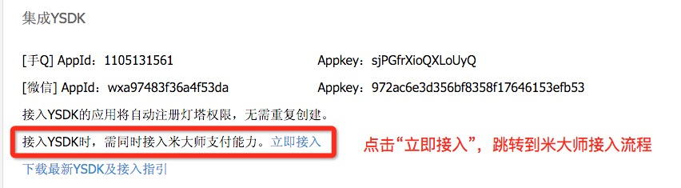
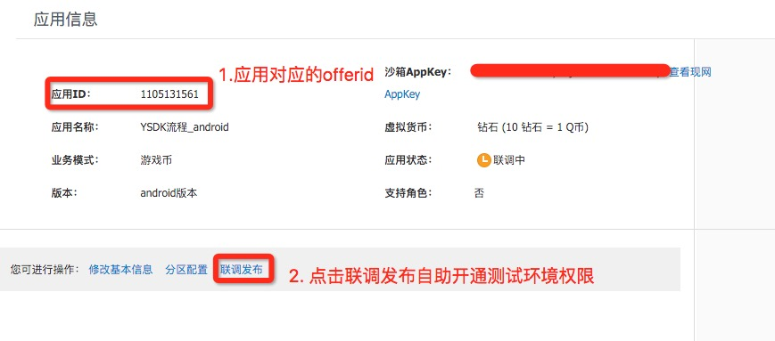
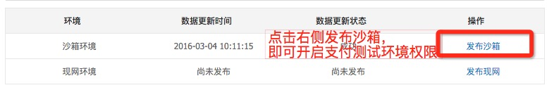
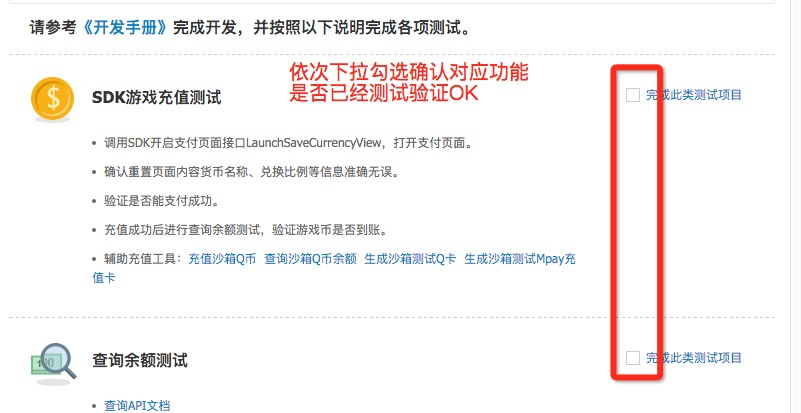
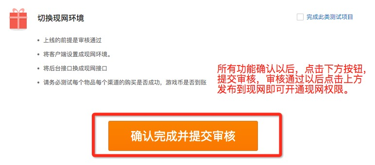
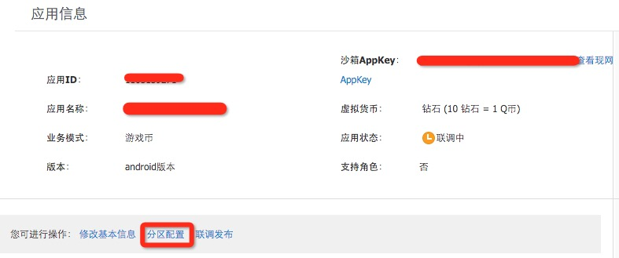
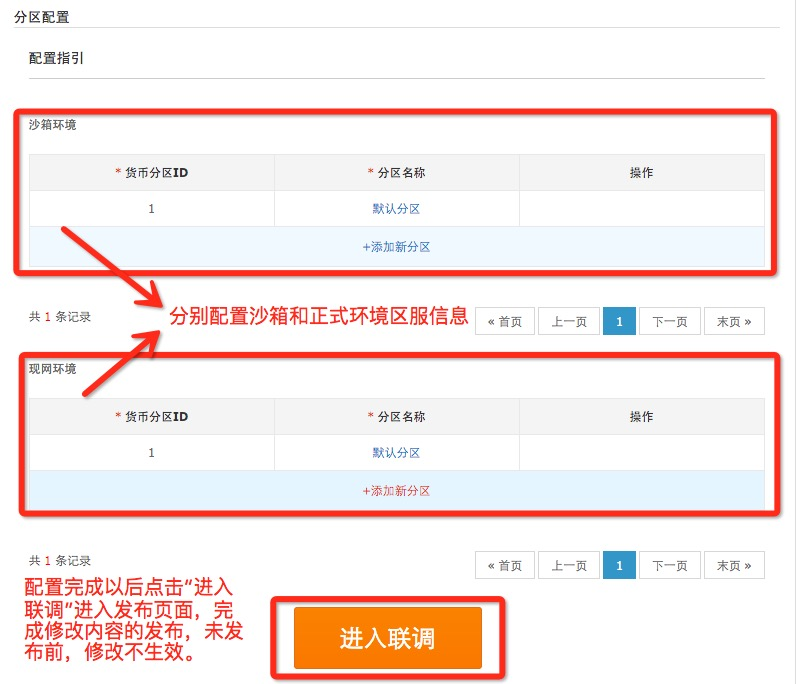
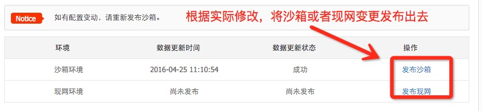

# 米大师介绍

## 1. 米大师简介

米大师（Midas）为腾讯官方唯一虚拟支付平台。原生支持Q点、微信支付、财付通余额、财付通快捷支付、手机充值卡、手机话费、QQ卡等支付渠道。

## 2 名词解释

### 2.1 offerid和appkey

offerid是midas中标示应用的唯一id，appkey主要用于游戏调用midas后台接口时计算sig。游戏可以在Midas接入页面查看两者信息。查看方法如下：

1. 在http://open.qq.com 完成基本资料审核后，**流程到达“接入YSDK”，签署合作接入协议提供手Q和微信的appid的页面，点击接入米大师支付能力后面的“立即接入”前往midas相关配置管理地址**，参照下图：

	

2. **跳转后地址如下图：**

	
	
	在上图中第1点的位置就可以看到游戏的offerID，后面就是对应的appkey。**切记游戏在沙箱和正式环境的appkey并不一致。**

### 2.2 Midas环境及权限

#### 2.2.1 Midas沙箱环境权限

1. 在http://open.qq.com 完成基本资料审核后，**流程到达“接入YSDK”，签署合作接入协议提供手Q和微信的appid的页面，点击接入米大师支付能力后面的“立即接入”前往midas相关配置管理地址**，参照下图：

	
	
2. 在midas相关配置界面，点击下图中第2点的位置，进入联调发布的界面

	

2. 点击下图中图示地方，的“发布沙箱”，如下图，即可开启应用支付的测试环境权限。

	

#### 2.2.2 Midas 正式环境权限

1. 在http://open.qq.com 完成基本资料审核后，**流程到达“接入YSDK”，签署合作接入协议提供手Q和微信的appid的页面，点击接入米大师支付能力后面的“立即接入”前往midas相关配置管理地址**，参照下图：

	
	
2. 在midas相关配置界面，点击下图中第2点的位置，进入联调发布的界面

	

3. 在联调发布界面（如下图），依次确认对应的功能是否已经测试。

	

3. 当所有项目都确认以后，在图示的地方，点击“确认完毕并提交审核”后，提交审核。

	

至此，应用所有的正式环境权限都已经OK，可以准备上线，**提交审核以后可以联系企业QQ(800013811)了解审核的进度**。

### 2.3 游戏币

- 名词解释：

	游戏内的货币比如钻石或者元宝我们统称游戏币，在支付信息配置页面可以设置游戏币名称，请务必注意**游戏币名称在应用上线后不可更改；是游戏内专属的通用货币而不是腾讯游戏币，其他游戏不可用！**目前只支持游戏币托管模式接入。 

### 2.4 大区ID（zoneid）

- 名词解释：

	**大区ID主要提供给分区分服类游戏使用，若游戏不分区，默认填1即可，分区ID间账户独立。在支付结算页面分区配置可以自主配置，切记配置完成后同步成功才生效可用。**

- 配置方法：

	1. 进入游戏Midas接入的地址（合同签署页面跳转到midas的地址）
	
		
		
	2. 点击上图中红框中的“分区配置”，进入应用区服信息配置页面，然后根据游戏信息完善对应的分区配置，配置结束以后点击进入联调，前往。
	
			
	3. 在联调界面，根据刚才的修改，点击图示位置将修改发布出去。
	
		
	
	至此，应用在对应环境的分区配置信息已经发布出去，可以测试验证。

## 3.游戏接入米大师流程

游戏米大师支付能力的接入主要包括以下几步：

1. 米大师注册，这步目前由YSDK自动完成，游戏无需单独注册。
- 应用相关信息配置，主要是应用名称以及虚拟货币的货币类型、兑换比例配置。
- 沙箱环境配置。配置游戏在沙箱的大区id，名词解释中已经有说明。
- 沙箱联调，开发者开始在沙箱环境联调相关功能。midas提供了充值沙箱Q币等功能，详细参考midas联调配置界面（名词解释中已经有说明）。
- 正式环境配置。当开发者在沙箱测试所有功能都已经OK以后，就可以提交正式环境权限开通的申请。按照米大师环境介绍中提供的指引提交审核。
- 正式环境验证。当正式环境审核通过以后，游戏开通正式环境权限，就可以在正式环境验证功能是否OK。