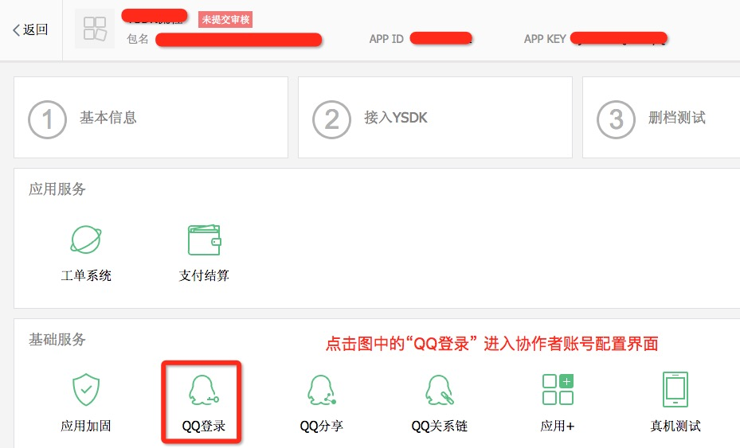
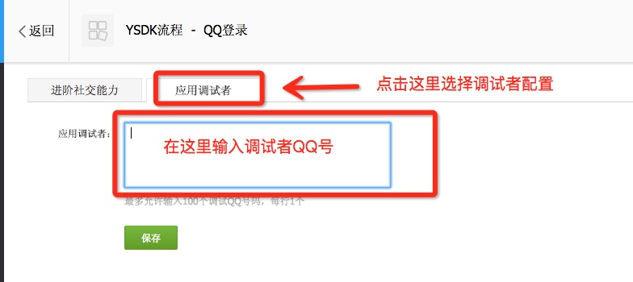

## 微信、手Q接入

## 1. 模块介绍

1. YSDK 从 1.0.0 版本开始支持接入QQ和微信登录体系。通过该功能，应用开发者可以同时使用QQ和微信的第三方登录体系，并且可以获取用户授权后的基本信息。

2. **该模块在接入时除了在AndroidMainfes添加声明外，还需修改应用assers目录下ysdkconf.ini文件中手Q和微信的appid(修改方法参考SDK接入中的介绍)。该模块无需额外的初始化工作，所有工作，在初始化YSDK时已经由SDK完成。**

- 应文化部要求，YSDK从 1.2.0版本开始加入未实名认证用户登录游戏需要实名认证的功能。具体接入方法请参考下方登录接入模块。

## 2. 接入前提

1. 游戏已经申请到微信和手Q的appid，[点击了解怎么查看游戏的appid]()
2. 游戏已经开通YSDK对应环境的权限，[点击了解怎么开通游戏YSDK环境的权限]()

## 3. 配置修改

### 3.1 手Q 接入AndroidMainfest修改

- 游戏按照下面的事例填写配置信息。

		<!-- TODO SDK接入 QQ接入配置 START -->
		<activity
		    android:name="com.tencent.tauth.AuthActivity"
		    android:launchMode="singleTask"
		    android:noHistory="true" >
		    <intent-filter>
		        <action android:name="android.intent.action.VIEW" />
		        <category android:name="android.intent.category.DEFAULT" />
		        <category android:name="android.intent.category.BROWSABLE" />
		        <data android:scheme="tencent游戏的手Q appid" />
		    </intent-filter>
		</activity>
		<activity
		    android:name="com.tencent.connect.common.AssistActivity"
		    android:configChanges="orientation|screenSize|keyboardHidden"
		    android:screenOrientation="portrait"
		    android:theme="@android:style/Theme.Translucent.NoTitleBar" />
		<!-- TODO SDK接入 QQ接入配置 END -->

- **注意事项：**

	1. **com.tencent.tauth.AuthActivity的intent-filter中的`<data android:scheme="tencent游戏的手Q appid" />`
	中tencent后填写游戏的手Q appid。**例如：`<data android:scheme="tencent100703379" />`

	- **游戏的Activity的launchMode需要设置为singleTop**, 设置为singleTop以后在平台拉起游戏的场景下, 有可能会出现游戏Activity被拉起两个的情况, 所以游戏Activity的onCreate里面需要检测当前Activity是否是重复的游戏Activity, 如果是则要finish掉当前游戏Activity。

### 3.2 微信接入AndroidMainfest修改
	
- 游戏按照下面的事例填写配置信息。

		<!-- TODO SDK接入 微信接入配置 START -->
        <activity
            <!-- 注意：此处应改为 游戏包名.wxapi.WXEntryActivity -->
            android:name="com.tencent.tmgp.yybtestsdk.wxapi.WXEntryActivity"
            android:excludeFromRecents="true"
            android:exported="true"
            android:label="WXEntryActivity"
            android:launchMode="singleTop"
            <!-- 注意：此处应改为 游戏包名.diff -->
            android:taskAffinity="com.tencent.tmgp.yybtestsdk.diff">
            <intent-filter>
                <action android:name="android.intent.action.VIEW" />
                <category android:name="android.intent.category.DEFAULT" />
                <!-- 注意：此处应改为 游戏的微信appid -->
                <data android:scheme="wxfcefed3f366fa606" />
            </intent-filter>
        </activity>
        <!-- TODO SDK接入 微信接入配置 END -->

- **注意事项：**

	1. 将WXEntryActivity.java放置在应用包名+.wxapi下面.
	- 微信接入的Activity中有三处需要游戏自行修改，上面的注释有具体说明：
		- WXEntryActivity的android:name需要修改
		- WXEntryActivity的android:taskAffinity需要修改
		- WXEntryActivity的data中android:scheme需要修改

### 3.3 实名制接入AndroidMainfest修改
	
- 游戏复制下面的事例填写到AndroidMainfest。

		 <!-- TODO GAME SDK接入YSDK实名制接入配置 START -->
        <activity
            android:name="com.tencent.ysdk.module.realName.impl.RegisterRealNameActivity"
            android:configChanges="orientation|screenSize|keyboardHidden"
            android:screenOrientation="sensor"
            android:theme="@android:style/Theme.Translucent.NoTitleBar">
        </activity>
        <!-- TODO GAME SDK接入YSDK实名制接入配置 END -->

## 4. 登录接入

### 4.1 概述：

1. 用户触发登录以后，拉起手Q/微信客户端授权，在用户授权以后通过设置的全局的UserListener的onLoginNotify通知游戏获取到的openID、accessToken、payToken、pf、pfkey等登录信息。

- 游戏在收到onLoginNotify以后，可以完成用户登录相关的操作，建议游戏不要缓存票据，当游戏需要使用票据的时候，可以直接调用YSDK的接口获取。

- **为了保证提供给游戏的票据的有效性，YSDK会在三种情况下（每次游戏启动、后台运行一分钟以上切换回前台、在前台持续运行30分钟以上）触发自动验证票据有效性的逻辑，并将验证结果通过loginNotify回调给游戏（回调内容与游戏主动调用login接口一致）。游戏接入中无需关心具体调用的时机，只需要在收到对应的回调时按照错误码推荐的处理方式处理即可。**

- **YSDK从 1.2.0版本开始在登录流程增加了实名验证的流程，未实名认证用户登录游戏需要实名认证。目前暂不开放游戏自定义UI，所有游戏使用YSDK定义的统一UI风格，游戏需要按照文档说明修改AndroidMainfest。同时实名验证失败时会返回对应的flag，游戏可以在Wiki上常量查询的入口查看**

### 4.2 用户登录接口：

- 接口声明：

		/**
	     * 用户登录
	     */
		void login(ePlatform platform);
	
- 接口调用：
 
 		YSDKApi.login(ePlatform.QQ);
 		
### 4.3 获取登录信息接口：

- 接口声明：

		/**
	     * 获取用户登录态数据
	     */
		int getLoginRecord(UserLoginRet& userLoginRet);
	
- 接口调用：
 
 		UserLoginRet ret = new UserLoginRet();
    	int platform = YSDKApi.getLoginRecord(ret);
    	String accessToken = ret.getAccessToken();
    	String payToken = ret.getPayToken();
    	String openid = ret.open_id;
    	int flag = ret.flag;
    	String msg = ret.msg;
    	String pf = ret.pf;
    	String pf_key = ret.pf_key;

### 4.4 用户注销接口：

- 接口声明：

		/**
	     * 用户注销
	     */
		void logout();
	
- 接口调用：
 
 		YSDKApi.logout();
 		
### 4.5 登录接入注意事项：

#### 4.5.1. **通用**：

- **因为微信和手Q各自的bug，会导致游戏在多个场景下收不到回调。游戏在调用login后可以开始一个倒计时, 倒计时完毕如果没有收到回调则算作超时, 让用户回到登录界面。倒计时推荐时间为30s，游戏也可以自己设置**其中收不到回调的场景包括但不限于：
	1. 在微信未登录的情况下, 游戏拉起微信输入用户名密码以后登录, 可能会没有登录回调, 这是微信客户端已知BUG
	- 微信授权过程中, 点击左上角的 返回 按钮, 可能会导致没有授权回调
	- openSDK 2.7 （MSDK 2.5）以下版本通过web授权点击取消授权以后没有回调
	- **游戏接入过程中如果想体验实名制相关功能，可以在下面的界面查看当前账号是否已经有实名注册：[http://jkyx.qq.com/web2010/faq.htm](http://jkyx.qq.com/web2010/faq.htm)**

#### 4.5.2 **手Q 相关**：
	
1. **游戏在正式上线前，手Q只能使用协作者账号登录，否则会在登录时，在手Q的界面报110406或者110404错误。可以[点击查看如何添加协作者账号]()。**。
- 没有安装手Q的时，精品游戏可以拉起Web页面授权,请确保AndroidMenifest.xml中AuthActivity的声明中要在intent-filter中配置<data android:scheme="***" />, 详见本节手Q相关AndeoidMainfest配置处。 **海纳游戏现在不支持拉起页面授权**。可以通过WGIsPlatformInstalled接口判断是否安装手Q，未安装手Q则提示用户不能授权。
- **偶尔收不到OnLoginNotify回调：**请确保`com.tencent.tauth.AuthActivity`和`com.tencent.connect.common.AssistActivity`在`AndroidManifest.xml`与手Q接入权限申明（[点击查看]()）一致。
- 如果游戏的Activity为Launch Activity, 则需要在游戏Activity声明中添加android:configChanges="orientation|screenSize|keyboardHidden", 否则可能造成没有登录没有回调。
- 部分游戏在未装手Q时使用手Q登录，跳转到提示下载手Q的界面返回游戏时可能会引起Crash。出现此问题时，使用Unity直接打出Apk包的游戏把YSDK的jar包中的assets中的内容解压放入Android/assets中。如果使用其他方式打包，需要注意打包脚本中适当处理YSDK的jar包中的so文件和资源文件，如果还有问题可尝试把YSDK的jar包中的assets中的内容解压放入游戏工程中的assets目录。
	
#### 4.5.3 **微信相关**：

1. 微信授权需要保证微信版本高于4.0
- 拉起微信时候, 微信会检查应用程序的签名和微信后台配置的签名是否匹配(此签名在申请微信appId时提交过), 如果不匹配则无法唤起已经授权过的微信客户端.
- `WXEntryActivity.java` 位置不正确（必须在包名/wxapi 目录下）则不能收到回调.

## 5 获取用户信息

### 5.1 概述：

1. 用户通过手Q授权后, 游戏需要用户昵称, 头像等其他信息, 个人信息包含: nickname, openId, gender, pictureSmall, pictureMiddle, pictureLarge. 在游戏调用接口后通过设置的全局的UserListener的onRelationNotify通知游戏。

### 5.2 调用接口：

- 接口声明：

		/**
	     * 查询个人信息
	     */
		void queryUserInfo(ePlatform platform);
	
- 接口调用：
 
 		YSDKApi.queryUserInfo(ePlatform.QQ);

## 6 版本支持

### 6.1 手Q相关功能版本支持

手Q的功能与手Q版本相关，具体功能版本支持情况如下：

| 功能名称| 功能说明|Android 手Q支持情况|
|:-------------:|:------------:|:-------------:|
| 授权 |  |	4.1及以上 |
| 异帐号 | 平台拉起游戏是否带openid到游戏（异帐号） | 4.2及以上 |

## 7 登录接入常见问题

### 7.1 手Q登录异常检查步骤（手Q界面报错、没有回调等）

#### 第一步： 手Q点击授权登录的界面弹框报错100**等

- 首先确认游戏是否上线，如果游戏没有上线，检查登录的账号是否为协作者账号。协作者账号添加方法如下：

	1. 进入游戏在open平台的注册界面，点击下图中的QQ登录。
	
		
	
  	- 在跳转后的界面选择应用调试者，并输入调试者QQ好并确定。
	
		

- 如果添加调试者账号以后仍然报错，然后按照下面的报错错误码及具体解决方案进一步确认：

	- 100044：游戏当前安装包签名与平台上传的安装包签名不一致，请检查打包用的keystone。

		游戏也可下载[`https://res.wx.qq.com/open/zh_CN/htmledition/res/dev/download/sdk/Gen_Signature_Android2.apk`](https://res.wx.qq.com/open/zh_CN/htmledition/res/dev/download/sdk/Gen_Signature_Android2.apk)， 并将此apk安装到手机上， 在输入框中输入游戏的包名，点击按钮读取游戏包的签名。检查上述工具获取到的签名是否和微信后台配置的签名一致。

		
		
		**如果通过签名检查工具确认签名一致，并且确认使用了调试者QQ,请咨询企业QQ(800013811)解决。**
		
	- 110406：YSDK管理端后台签名未同步生效导致，在后台同步签名后重试。具体可以咨询企业QQ(800013811)解决。
	
#### 第二步： 检查签名、包名、appid

- 检查游戏在ysdkconf.ini文件中配置的appid是否正确
- 检查游戏在AndroidManfest中关于手Q的配置是否正确，配置方法参照上面接入配置的说明，重点检查com.tencent.tauth.AuthActivity和com.tencent.connect.common.AssistActivity的配置
- 检查com.tencent.tauth.AuthActivity的intent-filter中的<data android:scheme="tencent游戏的手Q appid" /> 中tencent后填写的是否为游戏的手Q appid
- 检查游戏的Activity的launchMode是否为singleTop。
- 检查无法登录的情形是否属于YSDK登录模块注意事项中提到的集中情形，[点击查看对应内容](http://wiki.open.qq.com/wiki/%E5%BE%AE%E4%BF%A1%E4%B8%8E%E6%89%8BQ%E6%8E%A5%E5%85%A5#4.5_.E7.99.BB.E9.99.86.E6.8E.A5.E5.85.A5.E6.B3.A8.E6.84.8F.E4.BA.8B.E9.A1.B9)
	
#### 第三步： 检查onActivityResult

游戏最后一次调用了YSDKApi.onCreate的Activity的onActivityResult是否调用了YSDKApi.onActivityResult。部分游戏有多个activity，确保要最后一个初始化的Activity里面调用onActivityResult。

#### 第四步：检查YSDK声明周期的设置

按照接入说明里面的调用说明检查是否在对应的声明周期调用了YSDK的声明周期函数。[点击查看YSDK声明周期设定](http://wiki.open.qq.com/wiki/%E5%BF%AB%E9%80%9F%E6%8E%A5%E5%85%A5#Step5._YSDK.E7.94.9F.E5.91.BD.E5.91.A8.E6.9C.9F.E8.AE.BE.E5.AE.9A)

#### 第五步：检查游戏的全局Observer是否设置

检查游戏有没有正确调用setUserListener（C++层和Java层）。

### 7.2 微信登录异常检查步骤（拉不起微信、没有回调等）

#### 第一步： 检查Log中是否有

	lauchWXPlatForm wx SendReqRet: true

有这一句表示已经成功发送请求到微信

如果微信客户端被不能被拉起来，请查看 第二步， 
如果微信客户端被拉起了，但是没有回调，请查看 第三步

#### 第二步： 检查签名、包名、appid

- 检查游戏在ysdkconf.ini文件中配置的appid是否正确
- 检查游戏在AndroidManfest中关于WXEntryActivity的配置是否正确，配置方法参照上面接入配置的说明，另外要重点检查下面三项：
	
	- WXEntryActivity的android:name需要修改
	- WXEntryActivity的android:taskAffinity需要修改
	- WXEntryActivity的data中android:scheme需要修改

- 下载[`https://res.wx.qq.com/open/zh_CN/htmledition/res/dev/download/sdk/Gen_Signature_Android2.apk`](https://res.wx.qq.com/open/zh_CN/htmledition/res/dev/download/sdk/Gen_Signature_Android2.apk)， 将此apk安装到手机上， 在输入框中输入游戏的包名，点击按钮读取游戏包的签名。检查上述工具获取到的签名是否和微信后台配置的签名一致。

	

#### 第三步： 检查WXEntryActivity.java放置的位置（此文件在YSDKDemo中）

此文件一定要放在 游戏+.wxapi 下面，例如游戏的包名为：com.tencent.ysdkdemo， 则WXEntryActivity.java 应该放在com.tencent.ysdkdemo.wxapi下。同时查看WXEntryActivity里面的内容是否和下面的一致

	/**
	 * !!此文件的代码逻辑部分使用者不要修改
	 */
	public class WXEntryActivity extends com.tencent.ysdk.module.user.impl.wx.YSDKWXEntryActivity { }

此步骤没问题请查看 第四步

#### 第四步：检查YSDK声明周期的设置

按照接入说明里面的调用说明检查是否在对应的声明周期调用了YSDK的声明周期函数。[点击查看YSDK声明周期设定](http://wiki.open.qq.com/wiki/%E5%BF%AB%E9%80%9F%E6%8E%A5%E5%85%A5#Step5._YSDK.E7.94.9F.E5.91.BD.E5.91.A8.E6.9C.9F.E8.AE.BE.E5.AE.9A)

#### 第五步：检查游戏的全局Observer是否设置

检查游戏有没有正确调用setUserListener（C++层和Java层）。
